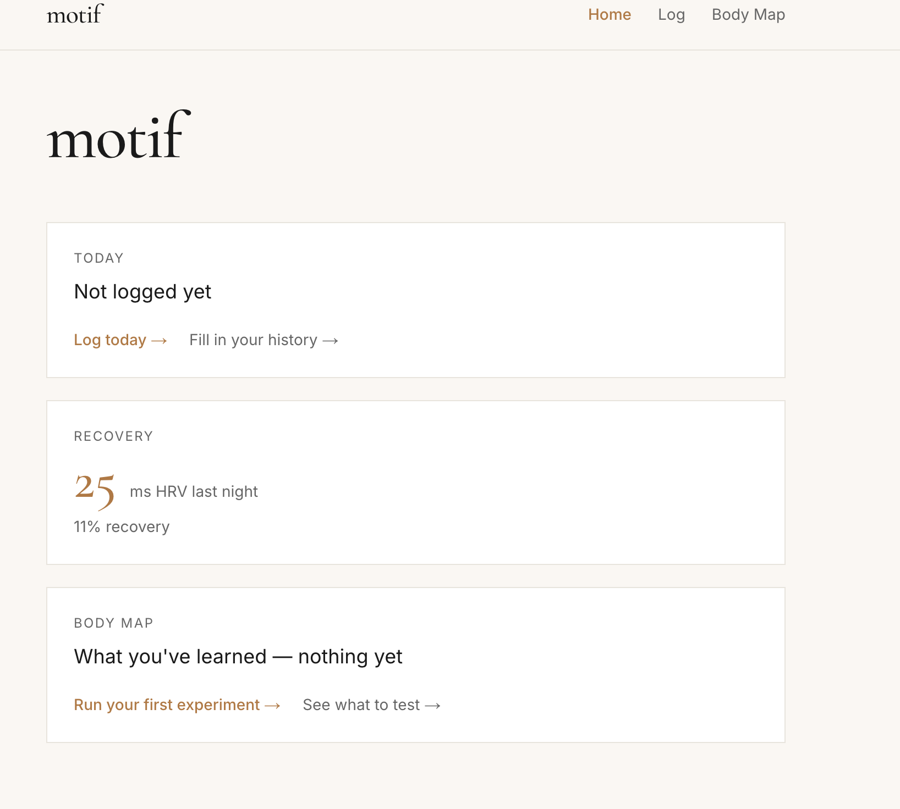
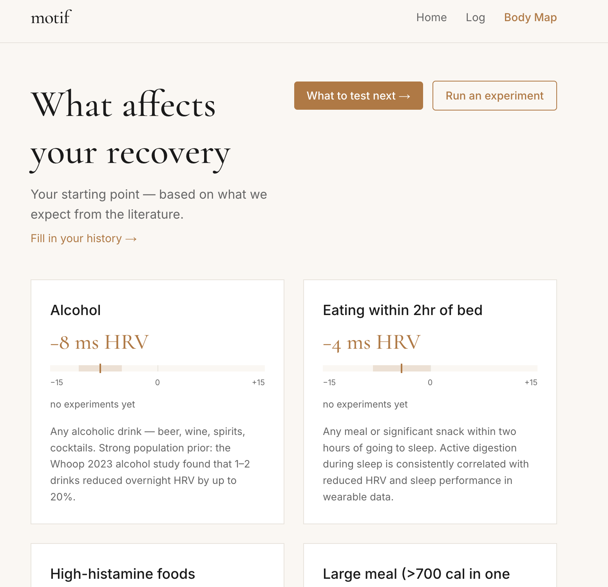
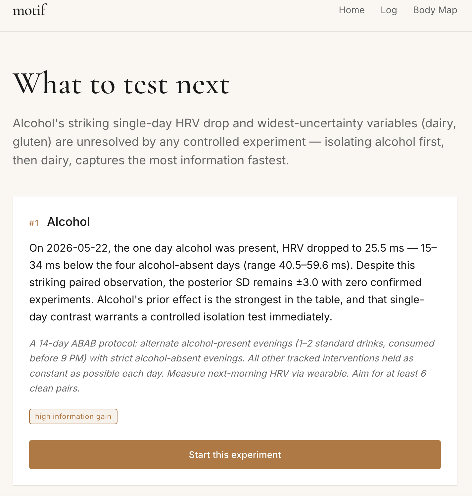

# motif n1

**An autonomous AI experimentation engine for personal food sensitivity discovery.**

motif n1 ingests heart rate variability and recovery data from Whoop, lets a user log dietary interventions, maintains a personal Bayesian posterior over how each intervention affects next-morning HRV, and uses Thompson sampling over those posteriors to autonomously decide which n-of-1 experiment to run next.

Built as the final project for CS 153 (Frontier Systems, Stanford, Spring 2026).

## What's novel

Existing wearable apps surface correlations. motif n1 runs randomized experiments and maintains a structured personal causal map.

- **Personal Bayesian posteriors that compound across experiments.** Each intervention has its own Gaussian posterior over its effect on the user's HRV in milliseconds. Updates are closed-form conjugate. Population priors from literature seed the system; structured n-of-1 experiments and weakened observational backfill tighten the posterior over time.
- **Thompson sampling for experiment selection.** The system samples once from each intervention's posterior and prioritizes the highest expected information gain — automatically balancing exploration of uncertain interventions with confirmation of strong signals.
- **Two evidence types, weighted correctly.** Structured 14-day ABAB protocols get full Bayesian weight; retrospective observational logs are weakened by halving their effective sample count, reflecting the lack of randomization.
- **LLM-grounded hypothesis generation.** A separate module calls Claude (Anthropic API) with the user's actual posteriors, paired log/HRV data, and intervention metadata to produce ranked, contextualized recommendations for what to test next. The voice is observational, never prescriptive, following the brand guidelines of the Motif product this engine is designed to plug into.

## Architecture

- **Data ingestion**: Whoop Developer API via OAuth 2.0, with token refresh
- **Backend**: FastAPI (Python), Supabase Postgres
- **Frontend**: Next.js 14 (App Router), Tailwind CSS, Cormorant Garamond + Inter
- **Bayesian engine**: closed-form conjugate Gaussian updates in NumPy (no MCMC)
- **Bandit**: Thompson sampling with uncertainty-weighted scoring
- **Protocol generator**: rule-based ABAB schedules with randomized counterbalancing
- **Hypothesis generator**: Anthropic Claude API with structured-output tool use, in-memory 5-minute cache

Six API endpoints support the full closed loop: `/api/experiments/select`, `/api/experiments/start`, `/api/experiments/complete`, `/api/posteriors`, `/api/backfill/run`, `/api/hypotheses/generate`.

## Screenshots



The body map — the system's current causal model of the user's body:



What to test next — Claude-generated hypotheses ranked by information gain:



## Methodology

The system is a closed-loop personalization engine inspired by Periodic Labs' methodology for autonomous scientific discovery, applied to the individual rather than to materials.

Each intervention starts with a population prior derived from the literature (e.g. alcohol: −8 ± 3 ms RMSSD, from the Whoop 2023 alcohol study). Two paths update the posterior:

1. **Observational backfill.** Retrospective daily logs paired with overnight HRV produce effect estimates. These are applied to the posterior via the standard conjugate update but with effective sample size halved, reflecting confounding from non-randomized data.
2. **Structured 14-day ABAB experiments.** The bandit selects which intervention to test next via Thompson sampling. The protocol generator produces a randomized counterbalanced schedule. At completion, the analysis pipeline computes the within-subject effect and applies a full-weight Bayesian update.

The hypothesis generator surfaces what the system would learn most from testing next — typically interventions with wide posteriors and no structured experimental data, prioritized by behavioral feasibility.

## Status

All system components are implemented and working end-to-end on real Whoop data. 26 unit tests pass against hand-computed expected values for the Bayesian update math. The system has ingested 59 days of personal HRV data and is accumulating dietary logs for the observational backfill phase. Structured experiments will run during the post-submission demo period.

## How to run locally

Prerequisites: Node 22+, Python 3.11+, a Supabase project, a Whoop developer app, an Anthropic API key.

1. Clone the repo
2. Copy `.env.example` to `.env` and fill in the credentials
3. Apply database migrations:
   ```bash
   cd backend
   .venv/bin/python -m db.migrate
   ```
4. Seed the intervention library:
   ```bash
   .venv/bin/python -m db.seed
   ```
5. Start backend:
   ```bash
   .venv/bin/uvicorn main:app --reload --port 8000
   ```
   For production, use the gunicorn-based script instead (binds `0.0.0.0`, respects `$PORT`, no reload):
   ```bash
   ./backend/run_prod.sh
   ```
6. In a separate terminal, start frontend:
   ```bash
   cd frontend
   npm install
   npm run dev
   ```

Visit `http://localhost:3000`, connect Whoop on `/connect`, sync data, log interventions on `/log` and `/history`.

## Deploying to production

First-time deploy checklist:

1. Set all required env vars in the deployment platform (see `.env.example`)
2. Set `ALLOWED_ORIGINS` to include the production frontend URL
3. Set `FRONTEND_URL` to the production frontend URL
4. Register the production OAuth callback URL in the Whoop developer console
5. Apply database migrations against the production Supabase project: `python -m backend.db.migrate`
6. Seed the intervention library: `python -m backend.db.seed`
7. Build the frontend with `NEXT_PUBLIC_API_URL` set to the production backend URL

## AI tools used

This project was built with significant AI assistance, in line with CS 153's encouragement of agentic development. Specifically:

- **Claude Code (Opus 4.7)** was used as the primary IDE. Essentially all backend Python code (FastAPI endpoints, database queries, OAuth flow, Bayesian engine, Thompson sampling bandit, protocol generator, hypothesis generator) and frontend code (Next.js pages, Tailwind styling) was written by Claude Code under my direction across approximately seven structured build sessions.
- **Anthropic API (Claude Sonnet 4.6)** is used at runtime by the hypothesis generator to produce ranked experiment recommendations based on the user's personal Bayesian posteriors and paired log/HRV data.

All 26 unit tests in `backend/ml/tests/` were generated by Claude Code and verify the Bayesian update math against hand-computed expected values to three decimal places.
